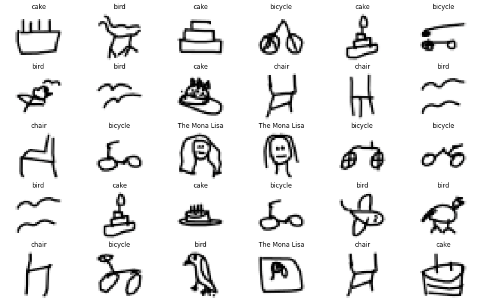

# Pictionary - Can you beat the machine?

I created a model that can be used to play Pictionary. The final outcome is an application where a user can draw. As the user is drawing, a model that is hosted on AWS makes predictions to try and classify the drawing. The methodology is a combination of a Neural Network trained and deployed on AWS and a drawing application using Tkinter in Python. The model is accessed through the use of an API, Lambda function, and Endpoint. 

The input of the model is an array representing a 28x28 drawing of the user. Locally, the user is drawing on an application using Tkinter. Whenever the user releases the mouse, the application takes a screenshot of the drawing and converts it to an array of size 784 representing the 28x28 picture. This is then sent to the model to make the prediction before it is displayed on a separate window.

**The model is trained and deployed on AWS SageMaker.**

  

## Requirements
* Google Cloud Storage
* PyTorch
* Scikit-Learn
* SageMaker

## References
* [The Quick, Draw! Dataset](https://github.com/googlecreativelab/quickdraw-dataset)

## Author
* Saad Chaouki - sd.chaouki@gmail.com

